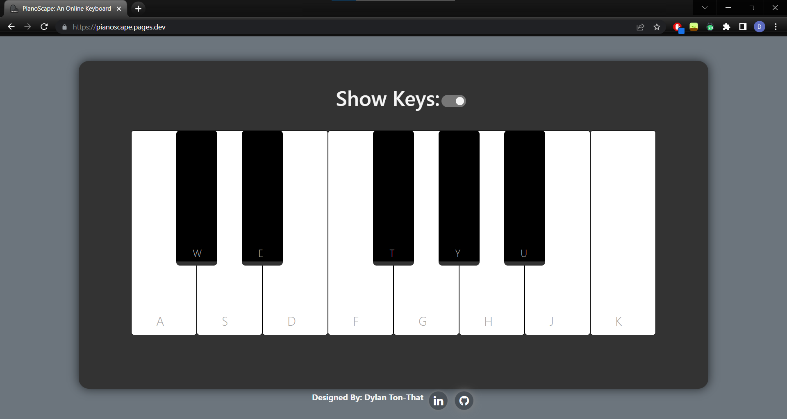

# PianoScape: 
Visit my Page [HERE](https://pianoscape.pages.dev)

This was a UI of an online piano that the user can open in any setting and play, whether it be for learning the basics or simply having a tune in their head.

## Technologies Used

* JavaScript
* BootStrap
* HTML5
* CSS3

### When in Portrait Mode:

### Mobile View:

### Laptop View:

